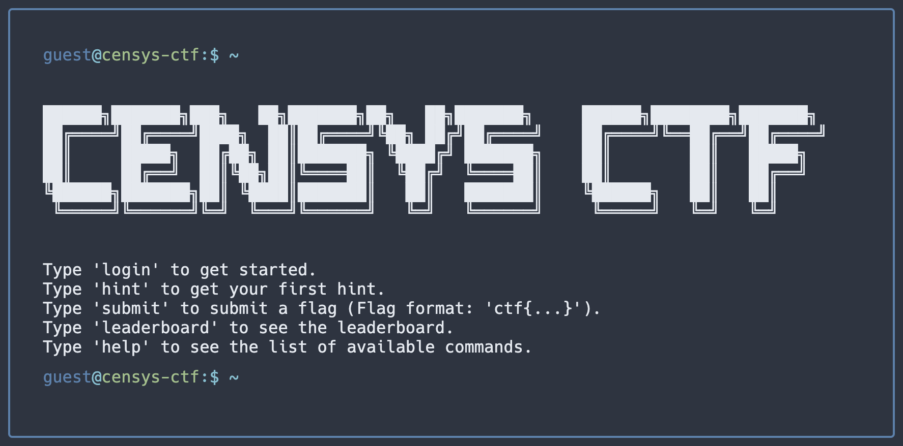
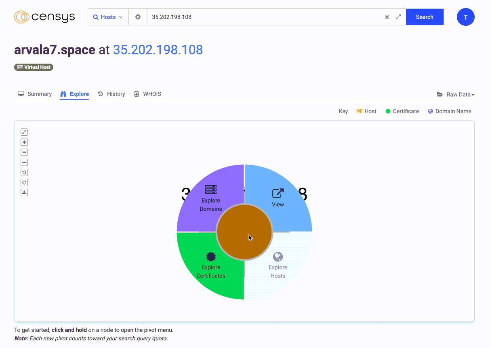

# Censys CTF - WriteUp

My writeup for the Censys CTF that ran during BlackHat 2022. Don't forget to checkout the [tips and tricks](#tips-and-tricks) section to improve your recon methodology ;)

<!-- more -->



## arvala7.space

> The hunt starts here: https://search.censys.io/hosts/35.202.198.108

We can see that there are 4 ports open:

- 17/UNKNOWN
- 22/SSH
- 23/UNKNOWN
- 80/HTTP
- 443/HTTP

Port 17 has the following banner:

> I've seen this raw strength only once before. It didn't scare me enough then. It does now. Flourish, my friend. Flourish. Dig around station.arvala7.space.

!!! info 
    "I've Seen This Raw Strength Only Once Before" is a memorable quote uttered by the character Luke Skywalker from the 2018 science fiction action film Star Wars: The Last Jedi. Online and it is now a [meme](https://knowyourmeme.com/memes/ive-seen-this-raw-strength-only-once-before).

If we *dig* around the DNS records for `station.arvala7.space` we can already see our first flag in a TXT record:

```
station.arvala7.space. TXT "ctf{6a935446-fba8-4cfc-9564-2c7d34f680a9}"
```

On port 80 & 443 we have the following HTML:

```html
<!DOCTYPE html PUBLIC "-//W3C//DTD HTML 4.01 Transitional//EN" "http://www.w3.org/TR/html4/loose.dtd">
<html>
  <head>
    <title>Arvala-7</title>
  </head>
  <body>
    <h1>Arvala-7</h1>
    <iframe src="/cgi-bin/arvala7.cgi" width="100%" height="100%"></iframe>
  </body>
</html>
```

Checking the `cgi-bin` directory we can see a directory listing with a `.env`. The `.env` contains another flag:

> export ARVALA7_FLAG="ctf{067744f3-bf37-4de3-b349-b6785825d386}"

If we look at the history tab in Censys we can see that `kintan.space` is linked to `aravala7.space`.

Searching for `arvala7.space` on Censys returns another IP hosted on GCP:  [104.198.164.172](https://search.censys.io/hosts/104.198.164.172)

The CN is `mobile-refinery.arvala7.space` and on port 80 and 443 there is a directory listing containing two files a `flag.txt`:

> ctf{85792f7f-5479-401e-9219-ceafc6a44d04}

and an image, in the image metadata is another flag:

> ctf{89d6276d-a741-4d0e-ace4-1666ffd12a07}

The port 10001 is open, if we connect to it using netcat we can interact with the service:

```
❯ nc 104.198.164.172 10001
I70100
2022-08-09 17:39:50

Mobile Refinery
Guild Territory
Arvala-7

  TANK  PRODUCT        VOLUME    HEIGHT    WATER     TEMP  NOTES
------  -----------  --------  --------  -------  -------  --------------------
     1  RHYDONIUM        7744        77       17  176.348
     2  PERAGIAN         7177        27       76  197.553
     3  ANTHRACITE       7426       373       50  120.421
     4  HYPERMATTER      7334       341       72  111.395  * Check tank status.
$ help
Commands: exit, help, shutoff, status, start, stop
$ status 4
Status: ON - ctf{606f2d57-e009-4f05-87bc-07530f14d5d0}
```

## kintan.space

Checking the DNS we can see a reference to Keybase:

```dns
kintan.space.		A	35.202.198.108
kintan.space.		TXT	"keybase-site-verification=Fl3sgIf2dUcm8WRi5LSYhp5aJcNxebi7zwJFoaDgSy8"
kintan.space.		MX	20 alt2.gmr-smtp-in.l.google.com.
kintan.space.		MX	30 alt3.gmr-smtp-in.l.google.com.
kintan.space.		MX	10 alt1.gmr-smtp-in.l.google.com.
kintan.space.		MX	40 alt4.gmr-smtp-in.l.google.com.
kintan.space.		MX	5 gmr-smtp-in.l.google.com.
kintan.space.		NS	ns-cloud-c3.googledomains.com.
kintan.space.		NS	ns-cloud-c1.googledomains.com.
kintan.space.		NS	ns-cloud-c4.googledomains.com.
kintan.space.		NS	ns-cloud-c2.googledomains.com.
```

The keybase user is: https://keybase.io/censysctf, the keybase account does not appear to lead anywhere else.

The HTML refence other planet:

- vodran
- sriluur

Both of them are available to register and are not referenced in the Keybase account.

The source code has an interesting comment though:


```html
 <!-- Make git clone pun -->
    <meta name="description" content="Kintan is a planet full of clones.">
```

There is a `.git` folder at the root and the HEAD leaks a flag:

> ref: refs/heads/ctf{fbcc3e59-51dd-4d0f-8335-3d9f0409e3e0}

Checking kintan.space on Censys leads to another IP: 35.222.118.123 and the CN `reactor.kintan.space`.

The HTML on port 80 and 443 leaks a new flag:

```html
<!DOCTYPE html PUBLIC "-//W3C//DTD HTML 4.01 Transitional//EN" "http://www.w3.org/TR/html4/loose.dtd">
<html>
  <head>
    <title>Supervolt Controls</title>
    <meta http-equiv="Flag" content="ctf{d82274e0-39e5-42d0-aa86-f6b3e0703215}">
```

The response header contains another flag: `X-Censys-Ctf-Flag: ctf{08ff2d0d-fc6d-4a0d-8235-1a453890d8d2}`

## Tips and tricks

### Censys Explore Feature
The main thing I learned during this CTF was how to use the "explore" feature that let you discover hosts and domains using a graph.

To use it you only need to navigate to the "[explore](https://search.censys.io/hosts/35.209.79.65/explore)" tab when looking at an host or domain, then either righ click or long click on the node to explore hosts, domains or certificate. Rinse and repeat and you should have all the relevant hosts and domains in no time:



### Uncover

If you need to automate some searches using Censys I recommend checking [uncover](https://github.com/projectdiscovery/uncover) by ProjectDiscovery.

Uncover let you quickly discover exposed hosts on the internet using multiple search engines such as Shodan, FOFA, Censys and more.

It can quickly be installed using:

```
go install -v github.com/projectdiscovery/uncover/cmd/uncover@latest
```

You can just pipe the query into uncover to see the results:

```
❯ echo 'arvala7.space' | uncover -e censys -silent
35.209.32.112:22
35.209.32.112:80
35.209.32.112:443
35.209.79.65:22
35.209.79.65:23
35.209.79.65:80
35.209.79.65:443
```

!!! warning
    The Censys agent for uncover does not include [Virtual Hosts](https://support.censys.io/hc/en-us/articles/4411773845524-Introduction-to-Virtual-Hosts). I created an [issue](https://github.com/projectdiscovery/uncover/issues/81) to see if the default can be changed or if they can add an option.

I'll let you check the [documentation](https://github.com/projectdiscovery/uncover) for more information on how to use uncover.